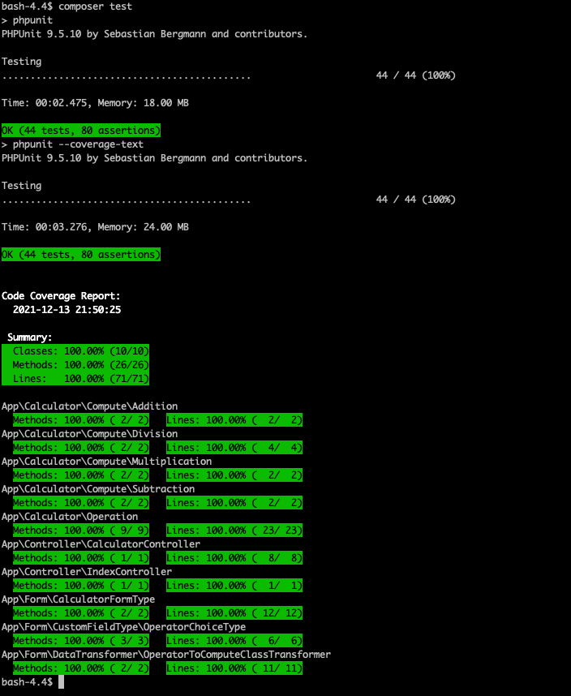

# php-calculator
Symfony5 - Simple Calculator

This is a simple Symfony5 based calculator which can compute four basic operations (Addition, Subtraction, Multiplication and Division) between two operands (operandA, operandB).

It can be accessed via https://localhost:8000/calculator/ endpoint.

> In order for someone to be able to access the backend and render the form, they will have to previously install all composer required components and run symfony's build in web server using following commands:

```bash
symfony server:ca:install
symfony serve
```


**Overview of the solution:**

Symfony is used to render a simple web form (using Symfony's Form feature and twig template system) with the following fields:
* ___Result___ : Will display the result of the calculation selected
* ___OperandA___ : Is a text box of the NumberType in which you are expected to provide  the first numeric value.
* ___OperandB___ : Is a text box of the NumberType in which you are expected to provide  the second numeric value.
* ___Operator___ : Is a select box via which you can select one of the four available operation types (Addition, Subtraction, Multiplication and Division)
* ___Calculate___ : Is the submit button which someone has to click to send a request to the backend to compute the selected operation and if everything is OK to populate the outcome in the result field.


**Code quality:**

Code quality tools (phplint, phpcs, phpmd, phpcpd) have been installed, configured and can be used when running the application in the development environment. These tools are used to check that code quality is not degrated during each implementation task and the coding styles selected i.e. PSR2 are honoured.


Someone can run these tools manually by simply using the following command:
```bash
composer code-quality-check
```

Furthermore, PHPUnit has been installed and configured and is used to automatically Unit/Functional test our code and produce a coverage report:



Someone can run PHPUnit manually by simply using the following command:
```bash
composer test
```

Finally, a basic GitHub pipeline has been configured to automatically run these tests each time a new commit is pushed to github.com against this repository.

